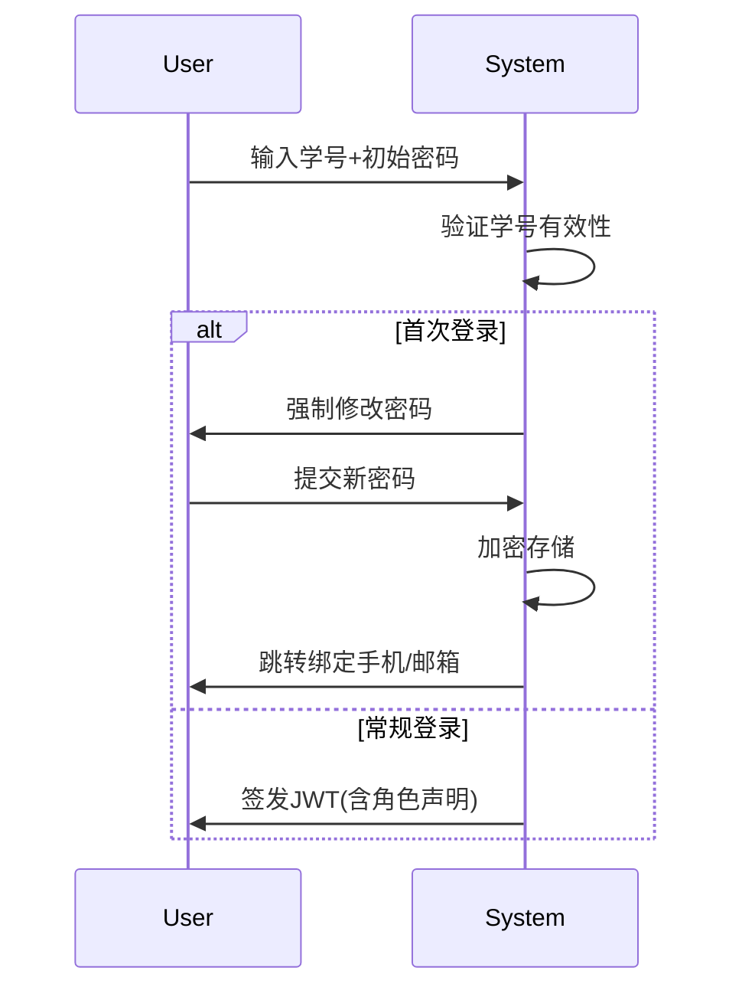
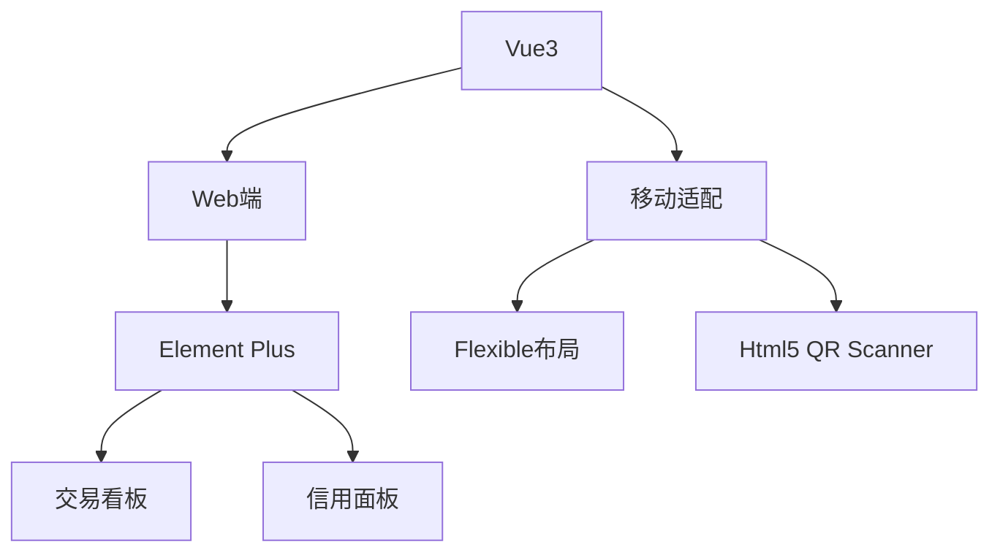
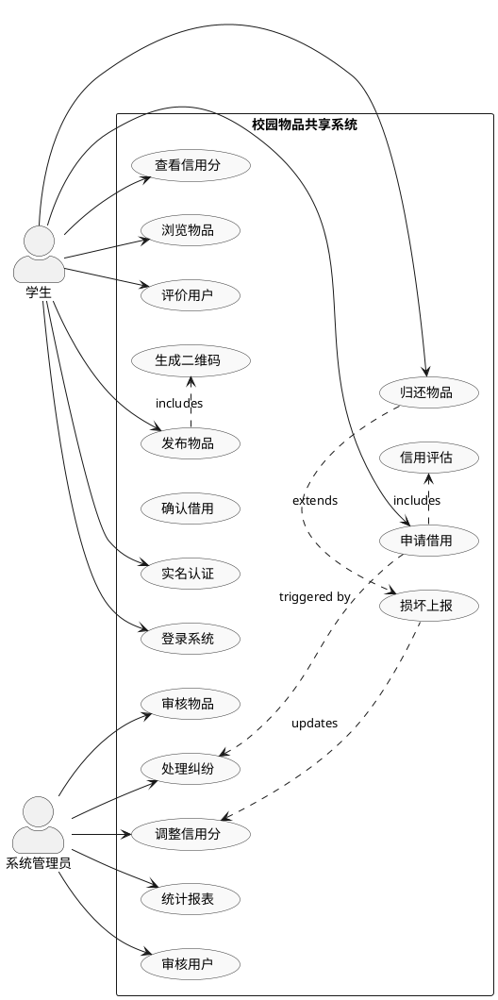
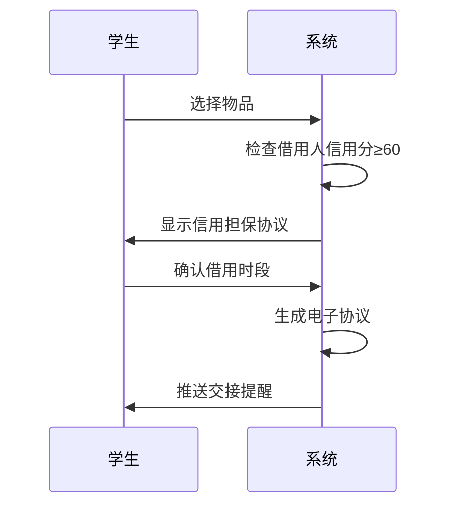

# Campus-Item-Sharing-Platform

## 项目命名规范

- **类名**需要使用大驼峰命名法（UpperCamelCase）风格。
- **方法名、参数名、成员变量、局部变量**需要使用小驼峰命名法（lowerCamelCase）。
- **测试方法名、常量、枚举名称**需要使用蛇形命名法（snake_case） ，比如test_get_user()、TIME_LIMIT。并且，测试方法名称要求全部小写，**常量**以及**枚举名称**需要全部大写。
- **项目文件夹名称**使用串式命名法（kebab-case），比如dubbo-registry。
- **包名**统一使用小写，尽量使用单个名词作为包名，各个单词通过 "." 分隔符连接，并且各个单词必须为单数。
- **抽象类**命名使用 Abstract 开头。如：public abstract class AbstractClient extends AbstractEndpoint{}。
- **异常类**命名使用 Exception 结尾。如：public class NoSuchMethodException extends RuntimeException{}。
- **测试类**命名以它要测试的类的名称开始，以 Test 结尾。如：public class AnnotationUtilsTest{}

## 项目简述

项目名称：基于微服务`Spring Cloud`的校园物品网上共享平台的设计与实现

主要面向在校大学生之间相互共享物品这样一个场景去进行设计，主要用户就是校内大学生，目前校内学生之间共享物品需要通过校园墙等等这样一些渠道去进行，这些类似的渠道一方面消息流通有限制，对与物品共享存在范围有限，保障有限的问题，另外一方面这些渠道缺乏保障，易发生诈骗相关违法问题，为了解决这些痛点，遂设计这样的一款软件来解决这些问题，便于校内学生进行安全快捷方便的物品共享。

主要围绕一下功能点去进行设计：

1. 校内用户身份的实名认证注册登录，考虑到设计到资金、物品等资产交易，必须要设计一套可靠的信用系统，于是决定将平台账号与实际的校内身份挂钩，进行实名认证注册，管理员审核后即可进行物品共享等等，关于信用分的设计还在考虑中。
2. 交易方式分为线上线下两种，线上方式采用论坛方式，在一个大的界面中去展示平台上目前上架的所有物品信息（类似于淘宝、京东），点击具体物品后进入具体页面，展示相关详细信息，并且有评论区来方便所有人进行交流，对于学校这种场景，线下的商品交易是必要的，所以设计了一种商品发布者可以去生成并打印包含对应商品信息以及一个唯一标识二维码的pdf打印张贴，如果有用户看上了对应的商品，即可扫码跳转到对应的具体页面来进行借用/购买等等操作（即线下转线上的模式）。
3. 围绕着物品共享这样的一个场景，认为在其中的部分环节需要设计一个管理平台来由管理员进行审核管理，比如用户的注册审核、商品的发布审核、以及对于后台信息的管理等等。
4. 物品借还信息记录，物品损坏信息记录等等

## 项目流程与对应产出

### 需求分析阶段

**目标**：明确系统的功能需求、性能需求、可用性需求等。

**产出**：

​	**需求文档**：记录系统的功能需求、非功能需求、用户故事、用例、技术栈等。

​	**用户故事**：描述系统对用户的行为需求。

​	**用例图**：描述用户与系统交互的功能流程。

​	**数据流图（DFD）**：展示系统数据流动和处理过程。

**设计图**：

​	**用例图**：展示用户和系统之间的交互。

​	**数据流图**：展示数据的输入、输出和存储过程。

### 系统架构设计阶段

**目标**：设计系统的整体架构，选择合适的技术栈，决定微服务的分布，定义服务之间的通信方式（例如，HTTP REST、消息队列等）。

**产出**：

​	**架构设计文档**：包括系统的总体架构设计、模块划分、技术选型等。

​	**服务划分文档**：定义每个微服务的功能、职责以及与其他服务的交互。

​	**API设计文档**：定义各微服务之间的API接口，包括输入、输出格式和数据约束。

**设计图**：

​	**架构图**：展示微服务系统的整体架构，例如各个微服务的模块、组件如何连接（Spring Cloud生态组件Eureka、Config Server、Gateway等）。

​	**模块图**：展示不同功能模块的划分，例如商品管理模块、用户管理模块、交易模块等。

​	**服务间调用图**：展示服务间的交互方式和协议。

### 详细设计阶段

**目标**：对系统进行详细设计，明确数据库设计、接口设计、微服务内部实现。

**产出**：

​	**数据库设计文档**：包括数据表结构、索引设计、关系图等。

​	**接口设计文档**：详细列出微服务的API接口，包括请求和响应的字段定义、数据格式、验证规则等。

​	**模块设计文档**：针对每个微服务模块，详细描述其内部实现逻辑。

**设计图**：

​	**类图**：针对每个微服务内部的类与类之间的关系（如：实体类、控制器、服务类等）。

​	**数据库表结构图（ER图）**：展示数据库表及其关系。

​	**时序图**：展示具体操作（如物品借出、归还等）过程中各个组件、微服务之间的交互顺序。

### 开发与实现阶段

**目标**：根据设计文档，开发微服务的代码实现，并进行单元测试、集成测试。

**产出**：

​	**开发文档**：记录开发过程中的问题、解决方案、代码实现的细节。

​	**代码**：根据设计文档实现微服务的功能。

​	**单元测试与集成测试报告**：确保代码符合需求，并且与其他服务能够正确集成。

**设计图**：

​	**流程图**：展示具体业务逻辑（如用户注册、商品借出等）的流程。

​	**状态图**：展示服务或系统的状态变化（如订单从“待支付”到“已支付”状态的转换）。

### 测试阶段

**目标**：进行系统的全面测试，包括功能测试、性能测试、安全性测试等。

**产出**：

​	**测试用例文档**：详细列出各个功能模块的测试场景与步骤。

​	**性能测试报告**：包括压力测试、负载测试等。

​	**安全性测试报告**：进行系统的安全性测试，确保数据隐私和系统的抗攻击能力。

**设计图**：

​	**系统测试图**：展示系统在不同负载下的表现，可能需要测试环境的架构图。

​	**异常流程图**：描述系统在异常情况下（如超时、断网等）的处理流程。

### 部署与运维阶段

**目标**：将系统部署到生产环境，并设置相应的监控与日志系统，确保系统稳定运行。

**产出**：

​	**部署文档**：描述系统的部署架构、步骤以及注意事项。

​	**运维文档**：包含日志系统、监控系统的配置，可能需要设置Spring Cloud的Hystrix、Eureka等监控组件。

​	**用户手册**：对最终用户的操作指南。

**设计图**：

​	**部署图**：展示系统部署在不同机器或容器中的方式，涵盖微服务的部署、数据库部署、消息队列部署等。

​	**监控与日志图**：展示监控系统架构（如Prometheus、Grafana、Spring Boot Actuator等），以及日志管理系统（如ELK Stack）。

### 维护与更新阶段

**目标**：根据用户反馈和监控数据，进行系统的维护和优化。

**产出**：

​	**更新日志**：记录每次发布新版本的内容，修复的bug，新增的功能等。

​	**性能优化文档**：记录在生产环境中发现的性能瓶颈及优化方案。

**设计图**：

​	**扩展架构图**：在系统运行后，根据需要进行功能扩展、模块增加的架构设计。

## 一、需求分析


### 校园物品共享平台需求文档（V1.0）

---

#### **1. 系统概述**

- **1.1 项目背景**  
  构建基于微服务的可信校园共享平台，实现学号体系认证、轻量化交易流程、信用积分管理三大核心功能，支持线上线下双模式运营。
- **1.2 目标用户**  
  - 主要用户：在校学生（本科生/研究生）  
  - 管理角色：系统管理员  


---

#### **2. 总体需求**
**2.1 系统架构**  

- 认证服务：Spring Security + OAuth2.0/JWT
- 交易服务：Spring Cloud Stream
- 支付服务：支付宝校园版API集成
- 信用服务：规则引擎+定时任务
- 文件服务：PDF生成/二维码管理

**2.2 功能矩阵**
| 模块     | 子功能                                    | 优先级 |
| -------- | ----------------------------------------- | ------ |
| 用户系统 | 登录/注册、修改密码、实名认证、信用分展示 | P0     |
| 商品管理 | 线上发布/线下二维码生成                   | P0     |
| 交易系统 | 线上支付/线下扫码租赁                     | P1     |
| 论坛模块 | 商品评论区/用户私信                       | P2     |
| 后台管理 | 审核流程/数据分析                         | P0     |

---

#### **3. 详细功能需求**
**3.1 用户模块**

- **3.1.1 实名认证流程**
  
  ```mermaid
  sequenceDiagram
      participant User
      participant System
      User->>System: 输入学号+初始密码
      System->>System: 验证学号有效性
      alt 首次登录
          System->>User: 强制修改密码
          User->>System: 提交新密码
          System->>System: 加密存储
          System->>User: 跳转绑定手机/邮箱
      else 常规登录
          System->>User: 签发JWT(含角色声明)
      end
  ```
- **3.1.2 信用体系**
  
  **积分规则表**：
  
  | 行为       | 分值变化 | 触发条件           |
  | ---------- | -------- | ------------------ |
  | 按时归还   | +3分/次  | 归还时间误差<1小时 |
  | 差评       | -5分/次  | 收到3星以下评价    |
  | 纠纷责任方 | -10分/次 | 管理员裁定有过错   |
  | 举报成功   | +2分/次  | 经审核属实         |
  
  **信用等级**：
  
  | 分数区间 | 等级   | 特权       |
  | -------- | ------ | ---------- |
  | 90-100   | 钻石   | 免押金租赁 |
  | 70-89    | 黄金   | 押金7折    |
  | 50-69    | 白银   | 押金全款   |
  | <50      | 黑名单 | 禁止交易   |

**3.2 商品模块**

- **3.2.1 线上发布流程**
  
  ```json
  {
    "title": "九成新自行车",
    "type": "租赁",
    "tags": ["交通工具","宿舍区A"],
    "deposit": 200,
    "daily_rate": 5,
    "location": "经纬度坐标",
    "images": ["pic1.jpg","pic2.jpg"]
  }
  ```
- **3.2.2 线下二维码规范**
  
  - 编码结构：XDU-{用户ID}-{物品ID}-{时间戳}`
  - 防伪措施：每6小时刷新一次二维码哈希值
  - PDF模板示例：
  ![二维码海报模板]

**3.3 交易模块**

- **3.3.1 线上支付流程**
  ```mermaid
  sequenceDiagram
    用户->>平台: 选择租赁周期
    平台->>支付宝: 生成预订单
    支付宝-->>用户: 扫码支付
    平台->>信用系统: 冻结押金
    平台->>双方: 短信通知交易详情
  ```
- **3.3.2 线下交接规范**
  - 扫码后生成电子合同
  - 需双方签署《物品状态确认书》
  - 启用GPS定位签到

---

#### **4. 非功能性需求**
**4.1 性能指标**
- 并发能力：支持5000+用户同时在线（JMeter测试）
- 响应时间：
  - 页面首屏加载：<1.5s
  - 二维码生成：<800ms
- 数据安全：
  - 敏感信息AES-256加密
  - 每日增量备份+异地容灾

**4.2 兼容性要求**
- 客户端：
  - 微信小程序（主要渠道）
  - Android/iOS APP（二期）
- 浏览器：
  - Chrome 90+ / Safari 14+
- 打印机：
  支持HP LaserJet系列PDF打印

---

#### **5. 用户故事与用例**
**5.1 典型用户故事**
- **故事1**（学生用户）  
"作为大二学生，我希望通过扫描宿舍楼下的二维码快速租到教科书，避免去图书馆排队"

**5.2 核心用例**
**用例名称**：线下物品租赁  
**参与者**：租借方（学生A）、出租方（学生B）  
**前置条件**：双方已完成实名认证  
**主流程**：
1. 学生B在公告栏张贴带二维码的海报
2. 学生A扫码查看物品详情
3. 系统验证A的信用分≥80
4. 线上支付押金及租金
5. 生成电子合同（含物品现状照片）
6. 线下交接物品并签字确认
7. 租赁期结束后系统自动退还剩余押金

**异常流程**：
- E1: 扫码发现二维码过期 → 提示联系发布者更新
- E2: 信用分不足 → 推荐担保人机制

---

#### **6. 附录**
**6.1 数据字典**
| 字段名      | 类型        | 示例        | 约束       |
| ----------- | ----------- | ----------- | ---------- |
| UserID      | VARCHAR(12) | 2020213321  | 学工号规则 |
| CreditScore | TINYINT     | 95          | 0-100范围  |
| QR_Code     | BLOB        | 0x89504E... | 加密存储   |

**6.2 技术选型清单**
- 认证服务：Keycloak
- 规则引擎：Drools
- 报表生成：Apache POI
- 地理服务：高德地图API

---

该文档已覆盖主要功能点，建议在详细设计阶段补充以下内容：
1. 信用分的具体计算算法
2. 二维码防篡改的技术方案
3. 支付异常处理流程
4. 管理员审核工作台的交互原型


### 校园物品共享平台需求文档 V2.0

---

#### **1. 系统概述**
**1.1 项目背景**  
构建基于微服务的可信校园共享平台，实现学号体系认证、轻量化交易流程、信用积分管理三大核心功能，支持线上线下双模式运营。

**1.2 目标用户**  

- 主要用户：在校学生（本科生/研究生）  
- 管理角色：系统管理员  

---

#### **2. 功能需求**

##### **2.1 用户认证模块**


**功能细则**：

- 初始密码规则：学号后6位 + 出生年月（如20200101）
- JWT配置：
  - 签名算法：HS512
  - 有效时间：2小时（可通过refresh token续期）
  - 包含声明：`userId`, `role`, `creditLevel`

##### **2.2 物品交易模块**

**线上流程：**

卖家

**线下流程简化版**：

1. 发布者生成带时效二维码（6小时有效）
2. 借用人扫码查看物品实时状态
3. 进入线上流程

##### **2.3 信用管理系统**
**积分规则表**：
| 行为       | 分值变化 | 触发条件           |
| ---------- | -------- | ------------------ |
| 按时归还   | +3分/次  | 归还时间误差<1小时 |
| 差评       | -5分/次  | 收到3星以下评价    |
| 纠纷责任方 | -10分/次 | 管理员裁定有过错   |
| 举报成功   | +2分/次  | 经审核属实         |

**信用等级**：
| 分数区间 | 等级   | 特权       |
| -------- | ------ | ---------- |
| 90-100   | 钻石   | 免押金租赁 |
| 70-89    | 黄金   | 押金7折    |
| 50-69    | 白银   | 押金全款   |
| <50      | 黑名单 | 禁止交易   |

---

#### **3. 非功能需求**

##### **3.1 性能指标**
| 场景       | 要求   | 测试方法        |
| ---------- | ------ | --------------- |
| 登录响应   | <800ms | JMeter 100并发  |
| 二维码生成 | <1s    | 模拟10种分辨率  |
| 交易并发   | 50TPS  | Gatling压力测试 |

##### **3.2 数据安全**
- **传输安全**：全站HTTPS（Let's Encrypt证书）
- **敏感数据**：
  - 密码：BCrypt哈希
  - 手机号：AES-128加密存储
- **备份策略**：
  - 每日3:00全库备份（mysqldump）
  - 备份保留策略：7天循环覆盖

##### **3.3 兼容性要求**
| 设备类型 | 支持范围            |
| -------- | ------------------- |
| 浏览器   | Chrome 85+/Edge 90+ |
| 分辨率   | 1920×1080 / 375×667 |
| 打印机   | 支持A4纸PDF打印     |

---

#### **4. 用户案例**

##### **4.1 典型用户旅程**
**场景：教科书租赁**  
1. 李同学在宿舍楼看到《数据结构》租赁海报
2. 扫码进入物品页面，查看已有3条好评
3. 支付200元押金（信用等级黄金，实付140元）
4. 与物主约定在图书馆交接
5. 三天后线下归还，双方点击确认完成
6. 系统自动解冻押金，信用分+3

##### **4.2 异常处理流程**
**案例：物品损坏纠纷**  
1. 归还时发现屏幕裂痕
2. 借用人在APP提交损坏报告（上传照片）
3. 系统冻结双方账户
4. 管理员查看交易时间轴：
   - 借出前照片对比
   - 租赁期间定位记录
5. 裁定责任方后执行押金扣款

---

#### **5. 技术架构**

##### **5.1 微服务划分**
| 服务名称       | 技术栈                   | 职责     |
| -------------- | ------------------------ | -------- |
| auth-service   | Spring Security + JJWT   | 认证授权 |
| trade-service  | Spring Data JPA + Quartz | 交易流程 |
| credit-service | Drools规则引擎           | 信用计算 |
| file-service   | MinIO + ZXing            | 文件管理 |

##### **5.2 前端方案**


---

#### **6. 附录**

##### **6.1 数据字典**
| 字段         | 类型                         | 说明       |
| ------------ | ---------------------------- | ---------- |
| user_id      | CHAR(10)                     | 学号/工号  |
| credit_score | DECIMAL(5,2)                 | 动态信用分 |
| item_status  | ENUM('可用','租赁中','维修') | 物品状态   |

##### **6.2 修订记录**
| 版本 | 主要变更                                                     | 日期    |
| ---- | ------------------------------------------------------------ | ------- |
| 2.0  | 1. 重构认证流程为JWT方案<br>2. 移除生物识别验证<br>3. 简化线下交接逻辑 | 2023.08 |

---

**备注**：本版本已移除复杂生物识别和GPS验证模块，聚焦核心教学场景需求，技术方案更贴合实际开发能力。建议使用Docker Compose搭建开发环境，优先实现认证与交易模块。


### 校园物品借用系统用例图（UML）



---

### **详细用例说明文档**

---

#### **1. 学生主要用例**

##### **1.1 发布物品**
- **触发条件**：用户通过实名认证
- **主流程**：
  1. 填写物品信息（名称、类别、照片）
  2. 设置可借用时段
  3. 系统生成动态二维码
  4. 提交管理员审核
- **异常流**：
  - 物品信息不完整 → 提示必填项
  - 二维码生成失败 → 重试机制

##### **1.2 申请借用**


##### **1.3 归还物品**
- **前置条件**：处于借用期内
- **关键操作**：
  - 双人扫码确认（借用双方）
  - 上传物品状态照片
  - 选择归还评价（五星评分）
- **数据变更**：
  ```sql
  UPDATE borrow_records 
  SET status = 'returned', 
      return_time = NOW()
  WHERE id = ?;
  ```

---

#### **2. 管理员核心用例**

##### **2.1 处理纠纷**
- **触发事件**：
  - 逾期超3天未归还
  - 收到损坏上报
- **处理流程**：
  1. 查看物品历史记录
  2. 对比借用前后照片
  3. 联系双方提供证据
  4. 执行信用分调整
  5. 标记纠纷解决状态

##### **2.2 信用分调整**
- **操作界面原型**：
  ```html
  <div class="credit-adjust">
    <h3>用户：2020213321 张三</h3>
    <p>当前信用分：75 → 
    <input type="number" value="70">
    </p>
    <select>
      <option>逾期归还</option>
      <option>物品损坏</option>
      <option>虚假信息</option>
    </select>
    <button>提交修改</button>
  </div>
  ```

---

#### **3. 信用系统核心机制**

##### **3.1 信用评估模型**
| 评估维度   | 权重 | 数据来源                |
| ---------- | ---- | ----------------------- |
| 历史履约率 | 40%  | 完成借用次数/总申请次数 |
| 物品完好度 | 30%  | 损坏上报记录            |
| 评价质量   | 20%  | 收到的平均评分          |
| 活跃程度   | 10%  | 每月平均互动次数        |

##### **3.2 信用分计算公式**
```
信用分 = 基础分(60) + 
         Σ(成功借用×2) - 
         Σ(逾期天数×1) - 
         Σ(损坏扣分×5)
```

---

#### **4. 异常处理规范**

##### **4.1 二维码失效场景**
```java
public void handleQRExpiry(String qrCode) {
  if (qrCode.expiryTime < System.currentTimeMillis()) {
    throw new QRExpiredException("二维码已过期");
  }
  // 刷新机制：每天0点自动更新所有有效二维码
}
```

##### **4.2 信用分不足处理**
- **系统自动建议**：
  - 完成信用教育课程（在线答题）
  - 邀请新用户注册（每邀请+3分）
  - 参与物品维护志愿活动

---

#### **5. 报表系统设计**

##### **5.1 关键统计指标**
| 指标       | 计算方式            | 可视化形式 |
| ---------- | ------------------- | ---------- |
| 物品周转率 | 借用次数/物品总数   | 折线图     |
| 损坏率     | 损坏上报数/总归还数 | 饼图       |
| 信用分布   | 各分数段用户占比    | 柱状图     |

##### **5.2 数据导出格式**
```csv
日期,物品ID,借用次数,平均借用时长,损坏情况
2023-08-01,CQUPT-0857,3,2.5天,无
2023-08-02,CQUPT-1123,1,7天,轻微刮痕
```

---

此用例图及说明文档已完整覆盖信用担保型物品借用系统的核心业务流程，建议配合原型设计工具（Axure/Figma）制作交互演示原型，并在开发阶段采用测试驱动开发（TDD）模式确保信用计算逻辑的准确性。

## 二、系统架构设计阶段

## 三、详细设计阶段

### 数据库设计

**E-R图**


**数据库创建**

```SQL
CREATE DATABASE `campus_item_sharing_platform` CHARACTER SET 'utf8mb4' COLLATE 'utf8mb4_unicode_ci';
```

使用 `utf8mb4` 字符集和 `utf8mb4_unicode_ci` 排序规则创建数据库。
